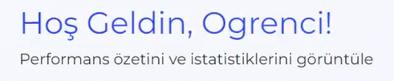

https://github.com/user-attachments/assets/6784b130-d63b-47a0-9801-1e0464c8c5d6

---

## Product Description

In today's digital age, secure and efficient online assessments are crucial for educational institutions. The **FU Examination System** is an advanced online examination platform designed to facilitate secure and efficient online assessments, competitions, and performance tracking for educational institutions.

---

<details>
  <summary><h2>Product Features</h2></summary>

### Examination Module

- **Create Exams**: Educators can create exams with a rich text editor, including code snippets and images.
- **Timed Exams**: Set time limits for each exam to simulate real exam conditions.
- **Automatic Grading**: Objective questions are graded automatically, providing immediate feedback.
- **Manual Grading Support**: Support for essay-type questions that require manual grading.
- **Result Analysis**: Detailed exam results with scores, correct answers, and explanations.

### Competition Module

- **Machine Learning Model Submission**: Participants can submit their machine learning models for evaluation.
- **Automatic Evaluation**: Models are evaluated against a test dataset; metrics such as F1 Score, Accuracy, Precision, and Recall are calculated.
- **Leaderboard**: A dynamic leaderboard showcasing top participants based on different metrics.
- **Daily Submission Limits**: Limits on the number of submissions per day to ensure fairness.
- **PIN-based Access**: Secure competitions with PIN codes provided by educators.
- **Tiebreakers**: Submission timestamps are used to break ties when scores are equal.

### Dashboard

- **Performance Tracking**: Visualize exam and competition performance over time through graphs and charts.
- **Recent Activities**: Keep track of recent submissions and activities.
- **Upcoming Events**: Notifications and countdowns for upcoming exams and competitions.
- **Global Leaderboard**: Display top performers across the platform.
- **Quick Access Links**: Navigate easily to commonly used sections.

### User Profile Management

- **Profile Customization**: Update personal information, profile picture, and bio.
- **Activity Summary**: Overview of participation in exams and competitions.
- **Achievements**: Display badges and achievements earned.
- **Privacy Settings**: Control visibility of profile information.

### Error Handling

- **Custom Error Pages**: Friendly and informative error pages for common HTTP errors (400, 401, 403, 404, 429, 500, 502).
- **Error Descriptions**: Each error page provides a brief description and suggestions for next steps.
- **Visuals**: Illustrated images to make error pages more engaging.

</details>

---

<details>
  <summary><h2>Target Audience</h2></summary>

- **Educational Institutions**: Schools, universities, and training centers looking for an online platform to conduct exams and competitions.
- **Educators**: Teachers and instructors who need to create and manage assessments.
- **Students**: Learners who will take exams and participate in competitions to assess their knowledge.
- **Developers**: Contributors interested in enhancing the platform's functionality.

</details>

---

<details>
  <summary><h2>Getting Started</h2></summary>

### Prerequisites

- **Python 3.8+**
- **Docker**
- **Git**
- **MongoDB** (if used for competition submissions)

### Installation

1. **Clone the Repository**

   ```sh
   git clone https://github.com/Ulwus/FU-Examination-System.git
   ```

2. **Navigate to the Project Directory**

   ```sh
   cd FUExaminationSystem
   ```

3. **Copy the Environment Variables File**

   ```sh
   copy FUExaminationSystem\.envexample FUExaminationSystem\.env
   ```

   > **Note:** Edit the `.env` file and configure the environment variables as needed.

4. **Database Setup**

   ```sh
   # Create and migrate database
   docker-compose exec web python manage.py makemigrations
   docker-compose exec web python manage.py migrate

   # Create superuser (admin)
   docker-compose exec web python manage.py createsuperuser
   ```

5. **Build and Run the Docker Containers**

   ```sh
   docker-compose up --build
   ```

   This command will build the Docker images and start the containers defined in the `docker-compose.yml` file.

</details>

---

<details>
  <summary><h2>Usage</h2></summary>

### Examinations

- **Creating Exams**: Access the instructor dashboard to create new exams with various question types.
- **Taking Exams**: Students can view available exams and start them within the specified time frames.
- **Reviewing Results**: After submission, students can view their scores and correct answers if permitted.

### Competitions

- **Joining a Competition**: Enter the provided PIN code to register for a competition.
- **Submitting Models**: Upload machine learning model files in `.pkl` format for evaluation.
- **Viewing Leaderboard**: Track rankings and compare performance with other participants.
- **Submission Limits**: Be mindful of daily submission limits as configured by the competition.

### Dashboard Overview

- **Performance Charts**: Analyze performance trends over time in both exams and competitions.
- **Recent Activities**: Stay updated with the latest submissions and results.
- **Upcoming Events**: Be aware of upcoming exams and competitions with countdown timers.
- **Global Leaderboard**: See where you stand among all users.

</details>

---

<details>
  <summary><h2>User Interface</h2></summary>

### Home Page

The home page serves as the dashboard for users, providing quick access to key features and displaying performance summaries.

**Sections:**

- **Welcome Banner**: Personalized greeting with the user's name.

  

- **Statistics Cards**: Overview of active competitions, exams, submissions, etc.

  

- **Performance Charts**: Visual graphs representing exam and competition performance.

  

- **Recent Activities**: List of the user's latest actions on the platform.

  

- **Global Leaderboard**: Top-performing users across the platform.

  

### Exam Interface

The exam interface is designed to provide a focused environment for students taking exams.

**Features:**

- **Exam Card**: Overview and objectives.

  

### Competition Detail Page

This page provides detailed information about a specific competition.

**Includes:**

- **Competition Card**: Overview and objectives.

  

- **Leaderboard**: Current rankings of top participants.

  

- **Model Upload Section**: Interface to submit new models.

  

### User Profile Page

The user profile page allows users to manage their personal information and view their activity.

**Features:**

- **Profile Picture and Bio**: Display and edit personal information.

  

### Error Pages

Custom error pages enhance user experience by providing helpful messages when something goes wrong.

**Implemented Error Pages:**

- **400 Bad Request**
- **401 Unauthorized**
- **403 Forbidden**
- **404 Not Found**
- **429 Too Many Requests**
- **500 Internal Server Error**
- **502 Bad Gateway**

Each page includes:

- **Error Code and Message**: Prominently displayed error code.
- **Description**: Brief explanation of the error.
- **Suggested Actions**: Links to navigate back or retry.
- **Illustrations**: Engaging images to make error pages more friendly.

</details>

---

<details>
  <summary><h2>Tech Stack</h2></summary>

## Backend
- **Framework:** Django 4.2+
- **Python:** 3.8+
- **Authentication:** Django Auth System
- **Task Queue:** Celery
- **Websocket:** Django Channels (IDE için)

## Frontend 
- **Framework:** Bootstrap 5.3
- **JavaScript:** Vanilla JS
- **Charts:** Chart.js
- **Icons:** Font Awesome 5
- **Animations:** AOS (Animate on Scroll)
- **Code Editor:** Ace Editor
- **Fonts:** Montserrat, Roboto

## Database & Storage
- **Primary Database:** MongoDB
- **Cache & Message Broker:** Redis
- **File Storage:** Local Media Storage

## Machine Learning
- **Libraries:**
  - scikit-learn
  - pandas
  - joblib (model serialization)

## DevOps & Infrastructure
- **Containerization:** Docker
- **Orchestration:** Docker Compose
- **Web Server:** Gunicorn
- **Environment:** python-dotenv

## Security
- **CSRF Protection:** Django Middleware
- **Authentication:** Session-based
- **Form Protection:** Django Forms
- **File Upload Security:** Django File Validators

## Monitoring & Logging
- **Logging:** Django Logging
- **Debug Tools:** Django Debug Toolbar
- **Error Tracking:** Custom Error Pages (400, 401, 403, 404, 408, 429, 500, 502)

## IDE Integration
- **Code Execution:** Custom Python Runtime
- **Editor:** Ace Editor Integration
- **Syntax Highlighting:** Multiple Language Support

</details>

---

<details>
  <summary><h2>Contributing</h2></summary>

We welcome contributions from the community.

**Steps to Contribute:**

1. **Fork the Repository**

   Click the **Fork** button at the top right of the repository page.

2. **Clone Your Fork**

   ```bash
   git clone https://github.com/YourUsername/FU-Examination-System.git
   ```

3. **Create a Feature Branch**

   ```bash
   git checkout -b feature/YourFeatureName
   ```

4. **Make Your Changes**

   - Ensure code style and linting guidelines are followed.
   - Write tests for new functionalities.

5. **Commit Your Changes**

   ```bash
   git commit -m "feat: Add YourFeatureName"
   ```

6. **Push to Your Fork**

   ```bash
   git push origin feature/YourFeatureName
   ```

7. **Create a Pull Request**

   - Go to the original repository.
   - Click on **Pull Requests**.
   - Click on **New Pull Request**.
   - Choose your branch and submit.

8. **Participate in Code Review**

   - Respond to any review comments.
   - Make necessary changes.

</details>

---

<details>
  <summary><h2>License</h2></summary>

This project is licensed under the **Attribution-NonCommercial 4.0 International** - see the [LICENSE](LICENSE) file for details.

</details>

---

<details>
  <summary><h2>Contact</h2></summary>

For questions or support, please contact:

- **Email**: ulwuss@gmail.com
- **GitHub Issues**: [Issue Tracker](https://github.com/Ulwus/FU-Examination-System/issues)

</details>

---

## Follow Me

[](https://www.linkedin.com/in/ulwus)

---
